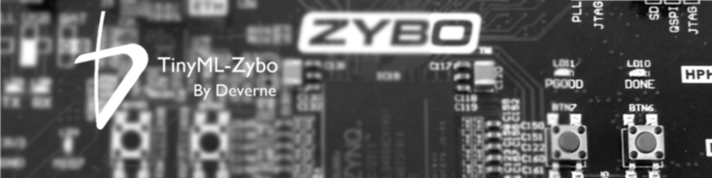
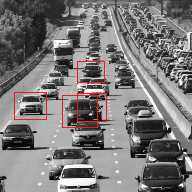

# TinyML-Zybo
This repository is a collection of artificial intelligence systems based on FPGA. It has been created for educational purpose. Both industrials &academics are more than welcome to give feedbacks on their learning process, or to contribute. 

At the moment, example designs are based on zybo-Z7 board with zynq 7020 FPGA only. 

## Zybo Base System design
This design is a base demonstration of running an image classifier on the zybo using the ResNet20 model and a FPGA hardware accelerator. An example of the output is given below 

Gateware & software sources and instructions can be found under the Zybo_base_system folder.

## Zybo YOLO System design
This design is a advanced demonstration of running image recognition on the zybo using TinyYolov4 and a FPGA hardware accelerator. An example of the output is given below

Gateware & software sources and instructions can be found under the Zybo_yolo_system folder.

Feel free to contact this e-mail adress for any questions : laurent.boutigny@deverne-france.com
Deverne can provide standard commercial support as well as consulting services 
